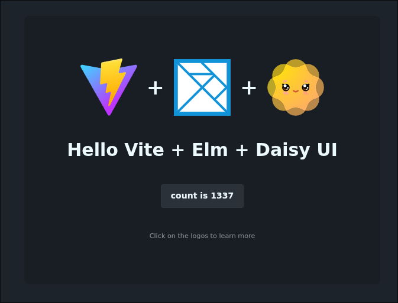

# vite-elm-daisyui

A simple template repository showcasing how to integrate [Vite](https://vite.dev), [Elm](https://elm-lang.org) and [daisyUI](https://daisyui.com)

## License

Public Domain, juse use it however you see fit
